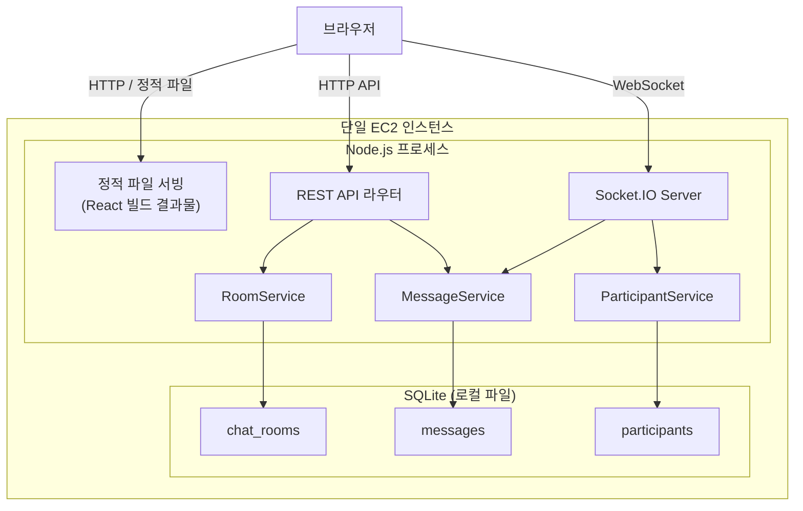

# 설계 문서: 대화방 (Chat Rooms)

## 개요

채팅방 기반 웹 애플리케이션으로, 사용자가 주제별 대화방을 생성하고, 목록을 탐색하며, 참여하여 실시간 메시지를 주고받을 수 있는 시스템을 설계한다. 소규모 사용자를 대상으로 하므로 단일 EC2 인스턴스에서 모든 서비스를 운영한다. 프론트엔드는 React + TypeScript로 빌드한 정적 파일을 Express가 직접 서빙하고, 백엔드는 Node.js + Express + Socket.IO를 사용하며, 데이터 저장소는 SQLite를 활용하여 별도의 데이터베이스 서버 없이 파일 기반으로 데이터를 관리한다.

핵심 기능:
- 대화방 CRUD (생성, 조회)
- 실시간 메시지 송수신 (WebSocket 기반)
- 대화방 참여/퇴장 관리
- 메시지 이력 영속화 (SQLite 파일 기반)

## 아키텍처

단일 EC2 인스턴스에서 Node.js 프로세스 하나가 REST API, WebSocket 서버, 정적 파일 서빙을 모두 담당한다. SQLite 데이터베이스 파일은 같은 인스턴스의 로컬 디스크에 저장된다.



### 배포 구조

- 단일 EC2 인스턴스에서 Node.js 서버 하나로 운영
- React 프론트엔드는 빌드 후 정적 파일로 Express의 `express.static()` 미들웨어를 통해 서빙
- SQLite 데이터베이스 파일(`chat.db`)은 EC2 인스턴스의 로컬 디스크에 저장
- 별도의 데이터베이스 서버, 로드 밸런서, CDN 불필요

### 통신 방식

- REST API: 대화방 생성, 목록 조회, 메시지 이력 조회 등 요청-응답 패턴
- WebSocket (Socket.IO): 실시간 메시지 전달, 참여/퇴장 알림 등 이벤트 기반 통신

## 컴포넌트 및 인터페이스

### REST API 엔드포인트

| 메서드 | 경로 | 설명 |
|--------|------|------|
| POST | `/api/rooms` | 대화방 생성 |
| GET | `/api/rooms` | 대화방 목록 조회 (최신순 정렬) |
| GET | `/api/rooms/:roomId` | 대화방 상세 조회 |
| GET | `/api/rooms/:roomId/messages` | 메시지 이력 조회 |

### Socket.IO 이벤트

| 이벤트 | 방향 | 페이로드 | 설명 |
|--------|------|----------|------|
| `room:join` | Client → Server | `{ roomId, userId, userName }` | 대화방 입장 |
| `room:leave` | Client → Server | `{ roomId, userId }` | 대화방 퇴장 |
| `message:send` | Client → Server | `{ roomId, userId, userName, content }` | 메시지 전송 |
| `message:new` | Server → Client | `Message` | 새 메시지 수신 |
| `room:user-joined` | Server → Client | `{ userId, userName, participantCount }` | 입장 알림 |
| `room:user-left` | Server → Client | `{ userId, userName, participantCount }` | 퇴장 알림 |


### 서비스 계층 인터페이스

```typescript
// RoomService
interface RoomService {
  createRoom(title: string, topic: string, creatorId: string, creatorName: string): Promise<ChatRoom>;
  getRooms(): Promise<ChatRoomSummary[]>;
  getRoomById(roomId: string): Promise<ChatRoom | null>;
}

// MessageService
interface MessageService {
  sendMessage(roomId: string, userId: string, userName: string, content: string): Promise<Message>;
  getMessagesByRoom(roomId: string): Promise<Message[]>;
}

// ParticipantService
interface ParticipantService {
  joinRoom(roomId: string, userId: string, userName: string): Promise<{ participantCount: number }>;
  leaveRoom(roomId: string, userId: string): Promise<{ participantCount: number }>;
  getParticipants(roomId: string): Promise<Participant[]>;
  getParticipantCount(roomId: string): Promise<number>;
}
```

### 프론트엔드 컴포넌트

```
App
├── RoomListPage          // 대화방 목록 페이지
│   ├── RoomCreateForm    // 대화방 생성 양식
│   └── RoomList          // 대화방 목록
│       └── RoomCard      // 개별 대화방 카드
└── ChatRoomPage          // 대화방 화면
    ├── MessageList       // 메시지 목록
    │   └── MessageItem   // 개별 메시지
    ├── MessageInput      // 메시지 입력
    └── ParticipantList   // 참여자 목록
```

## 데이터 모델

SQLite를 사용하므로 `better-sqlite3` 라이브러리를 통해 동기적으로 데이터베이스에 접근한다. UUID 생성은 애플리케이션 레벨에서 `uuid` 패키지를 사용한다.

### chat_rooms 테이블

| 컬럼 | 타입 | 설명 |
|------|------|------|
| id | TEXT PRIMARY KEY | 고유 식별자 (UUID, 앱에서 생성) |
| title | TEXT NOT NULL | 대화방 제목 |
| topic | TEXT NOT NULL | 대화방 주제 |
| creator_id | TEXT NOT NULL | 생성자 ID |
| creator_name | TEXT NOT NULL | 생성자 이름 |
| created_at | TEXT NOT NULL DEFAULT (datetime('now')) | 생성 시각 (ISO 8601) |

### messages 테이블

| 컬럼 | 타입 | 설명 |
|------|------|------|
| id | TEXT PRIMARY KEY | 고유 식별자 (UUID, 앱에서 생성) |
| room_id | TEXT NOT NULL REFERENCES chat_rooms(id) | 대화방 ID |
| user_id | TEXT NOT NULL | 전송자 ID |
| user_name | TEXT NOT NULL | 전송자 이름 |
| content | TEXT NOT NULL | 메시지 내용 |
| sent_at | TEXT NOT NULL DEFAULT (datetime('now')) | 전송 시각 (ISO 8601) |

### participants 테이블

| 컬럼 | 타입 | 설명 |
|------|------|------|
| room_id | TEXT NOT NULL REFERENCES chat_rooms(id) | 대화방 ID |
| user_id | TEXT NOT NULL | 사용자 ID |
| user_name | TEXT NOT NULL | 사용자 이름 |
| joined_at | TEXT NOT NULL DEFAULT (datetime('now')) | 참여 시각 (ISO 8601) |
| PRIMARY KEY | (room_id, user_id) | 복합 기본키 |

### TypeScript 타입 정의

```typescript
interface ChatRoom {
  id: string;
  title: string;
  topic: string;
  creatorId: string;
  creatorName: string;
  createdAt: Date;
}

interface ChatRoomSummary {
  id: string;
  title: string;
  topic: string;
  creatorName: string;
  participantCount: number;
  createdAt: Date;
}

interface Message {
  id: string;
  roomId: string;
  userId: string;
  userName: string;
  content: string;
  sentAt: Date;
}

interface Participant {
  roomId: string;
  userId: string;
  userName: string;
  joinedAt: Date;
}
```

## 정확성 속성 (Correctness Properties)

*속성(Property)이란 시스템의 모든 유효한 실행에서 참이어야 하는 특성 또는 동작을 의미한다. 속성은 사람이 읽을 수 있는 명세와 기계가 검증할 수 있는 정확성 보장 사이의 다리 역할을 한다.*

### Property 1: 대화방 생성 라운드트립

*For any* 유효한 제목과 주제 조합으로 대화방을 생성하면, 대화방 목록 조회 시 해당 대화방이 존재하며, 고유 식별자(id), 제목(title), 주제(topic), 생성자 정보(creatorId, creatorName), 생성 시각(createdAt)이 모두 보존되어야 한다.

**Validates: Requirements 1.2, 1.5, 2.2**

### Property 2: 생성자 자동 참여

*For any* 대화방 생성 요청에 대해, 생성이 완료되면 생성자가 해당 대화방의 참여자 목록에 자동으로 등록되어 있어야 한다.

**Validates: Requirements 1.3**

### Property 3: 대화방 생성 입력 검증

*For any* 공백 문자로만 구성된 문자열(빈 문자열 포함)을 제목 또는 주제로 사용하여 대화방 생성을 시도하면, 시스템은 생성을 거부하고 대화방 목록은 변경되지 않아야 한다.

**Validates: Requirements 1.4**

### Property 4: 대화방 목록 최신순 정렬

*For any* 서로 다른 생성 시각을 가진 대화방 집합에 대해, 대화방 목록 조회 결과는 생성 시각 기준 내림차순(최신순)으로 정렬되어야 한다.

**Validates: Requirements 2.3**

### Property 5: 참여/퇴장 참여자 수 라운드트립

*For any* 대화방과 사용자에 대해, 참여(join) 시 참여자 수가 1 증가하고 해당 사용자가 참여자 목록에 존재해야 하며, 퇴장(leave) 시 참여자 수가 1 감소하고 해당 사용자가 참여자 목록에서 제거되어야 한다.

**Validates: Requirements 3.2, 5.1**

### Property 6: 메시지 영속화 라운드트립

*For any* 유효한 메시지 내용, 전송자 정보, 대화방에 대해, 메시지를 전송한 후 해당 대화방의 메시지 이력을 조회하면 전송한 메시지가 존재하며, 내용(content), 전송자 이름(userName), 전송 시각(sentAt)이 모두 보존되어야 한다.

**Validates: Requirements 3.3, 4.2, 4.3**

### Property 7: 메시지 입력 검증

*For any* 공백 문자로만 구성된 문자열(빈 문자열 포함)을 메시지 내용으로 전송하려고 하면, 시스템은 전송을 거부하고 해당 대화방의 메시지 이력은 변경되지 않아야 한다.

**Validates: Requirements 4.4**

## 오류 처리

| 상황 | 처리 방식 |
|------|-----------|
| 대화방 생성 시 빈 제목/주제 | 클라이언트 측 유효성 검사 + 서버 측 400 Bad Request 응답 |
| 메시지 전송 시 빈 내용 | 클라이언트 측 전송 차단 + 서버 측 유효성 검사 |
| 존재하지 않는 대화방 접근 | 404 Not Found 응답 + 목록 페이지로 리다이렉트 |
| WebSocket 연결 끊김 | 자동 재연결 시도 (Socket.IO 기본 재연결 메커니즘 활용) |
| 데이터베이스 오류 | SQLite 파일 접근 실패 시 500 Internal Server Error + 사용자에게 일시적 오류 안내 |
| 중복 참여 시도 | 이미 참여 중인 경우 무시 (멱등성 보장) |

## 테스트 전략

### 단위 테스트 (Unit Tests)

- 테스트 프레임워크: Jest
- 대상: RoomService, MessageService, ParticipantService의 비즈니스 로직
- 주요 테스트 케이스:
  - 대화방 생성 시 빈 목록 상태에서의 동작 (요구사항 2.4)
  - 대화방 선택 시 화면 전환 (요구사항 3.1)
  - 새 메시지 수신 시 자동 스크롤 (요구사항 4.5)
  - 퇴장 후 목록 페이지 이동 (요구사항 5.3)

### 속성 기반 테스트 (Property-Based Tests)

- 테스트 라이브러리: fast-check
- 각 속성 테스트는 최소 100회 반복 실행
- 각 테스트에 설계 문서의 속성 번호를 태그로 표기
- 태그 형식: **Feature: chat-rooms, Property {번호}: {속성 설명}**
- 대상 속성:
  - Property 1: 대화방 생성 라운드트립
  - Property 2: 생성자 자동 참여
  - Property 3: 대화방 생성 입력 검증
  - Property 4: 대화방 목록 최신순 정렬
  - Property 5: 참여/퇴장 참여자 수 라운드트립
  - Property 6: 메시지 영속화 라운드트립
  - Property 7: 메시지 입력 검증

### 통합 테스트 (Integration Tests)

- 테스트 프레임워크: Jest + Socket.IO test client
- 대상: WebSocket 기반 실시간 통신
- 주요 테스트 케이스:
  - 대화방 입장 시 다른 참여자에게 알림 전달 (요구사항 3.4)
  - 메시지 전송 시 같은 대화방의 모든 참여자에게 실시간 전달 (요구사항 4.1)
  - 대화방 퇴장 시 다른 참여자에게 알림 전달 (요구사항 5.2)
