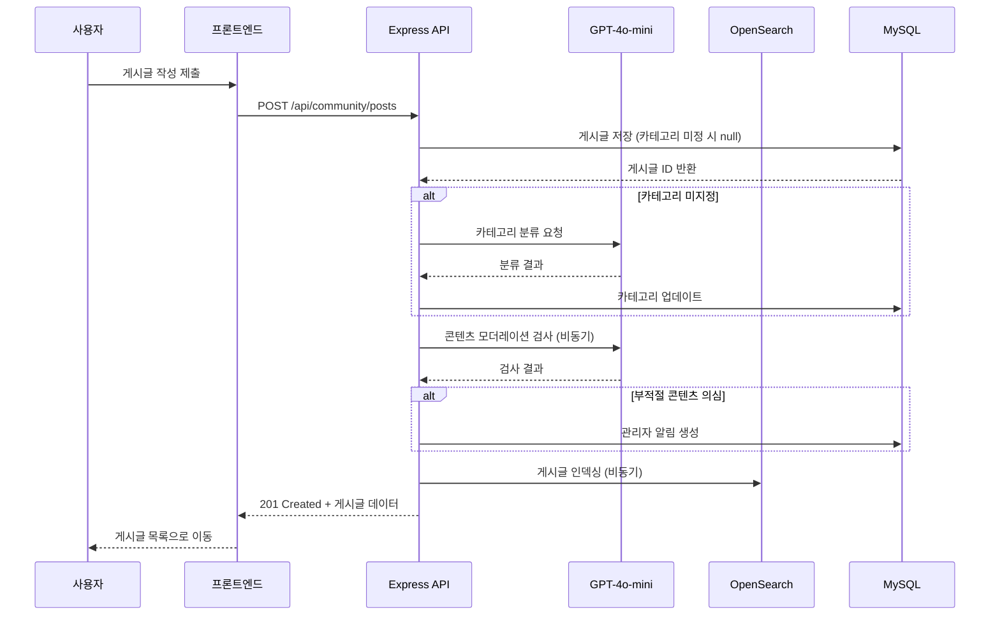
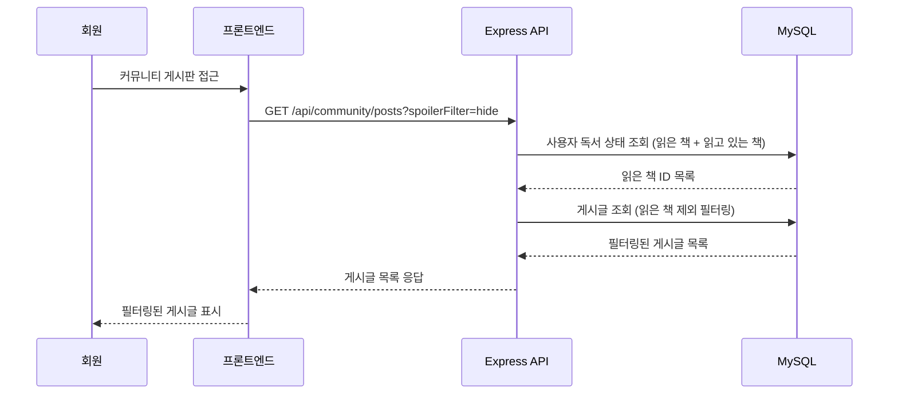

# 설계 문서: 커뮤니티 플랫폼 기능 (Community Platform Features)

## 개요

기존 독서토론 플랫폼을 책 커뮤니티 플랫폼으로 확장하는 설계이다. 사이트 구조를 재편하여 메인 페이지, 커뮤니티 게시판, 토론, 마이페이지로 네비게이션을 구성하고, 커뮤니티 게시판(카테고리별 글 작성/댓글/좋아요/스포일러 필터/검색), 마이페이지 개편(독서 상태 관리/토론 연동), 알림 시스템, AI 모더레이션, 신고 시스템을 구현한다.

### 설계 원칙

1. **기존 기능 보존**: 독서토론 기능(그룹, 메모, 토론, 대시보드)은 변경 없이 유지하며 "토론" 탭으로 이동
2. **확장 가능한 구조**: 10만 사용자 규모를 고려한 커서 기반 페이지네이션, 적절한 인덱싱
3. **AI 통합**: GPT-4o-mini를 활용한 카테고리 자동 분류 및 콘텐츠 모더레이션 (실패 시 서비스 차단 없음)
4. **점진적 구현**: 메인 페이지 인기 게시글/책은 UI 레이아웃만 우선 구성, 실제 로직은 추후 구현
5. **인프라 분리**: OpenSearch, Redis, S3 등 인프라는 별도 스펙에서 처리, 이 설계는 애플리케이션 레벨에 집중

## 아키텍처

### 전체 시스템 아키텍처

```mermaid
graph TB
    subgraph "프론트엔드 (React + Vite + TypeScript)"
        Nav[네비게이션 바]
        MainPage[메인 페이지]
        CommunityPage[커뮤니티 게시판]
        PostDetail[게시글 상세]
        MyPageNew[마이페이지 (개편)]
        DiscussionPage[토론 - 기존 유지]
        NotifPanel[알림 패널]
    end

    subgraph "백엔드 (Node.js + Express + TypeScript)"
        subgraph "라우터"
            CommunityRouter[/api/community/*]
            NotifRouter[/api/notifications/*]
            ReportRouter[/api/reports/*]
            ReadingRouter[/api/me/reading-status/*]
        end

        subgraph "서비스"
            PostService[게시글 서비스]
            CommentService[댓글 서비스]
            LikeService[좋아요 서비스]
            SpoilerService[스포일러 필터 서비스]
            NotifService[알림 서비스]
            ReportService[신고 서비스]
            AIClassifier[AI 분류기]
            AIModerator[AI 모더레이터]
            ReadingStatusService[독서 상태 서비스]
        end

        subgraph "외부 연동"
            OpenAI[OpenAI GPT-4o-mini]
            OpenSearch[OpenSearch]
            Redis[Redis]
        end
    end

    subgraph "데이터베이스 (MySQL/Aurora + Prisma)"
        DB[(MySQL)]
    end

    Nav --> MainPage
    Nav --> CommunityPage
    Nav --> DiscussionPage
    Nav --> MyPageNew
    Nav --> NotifPanel

    CommunityPage --> PostService
    PostDetail --> CommentService
    PostDetail --> LikeService
    CommunityPage --> SpoilerService
    NotifPanel --> NotifService
    PostDetail --> ReportService
    MyPageNew --> ReadingStatusService

    PostService --> AIClassifier
    PostService --> AIModerator
    AIClassifier --> OpenAI
    AIModerator --> OpenAI
    PostService --> OpenSearch
    NotifService --> Redis

    PostService --> DB
    CommentService --> DB
    LikeService --> DB
    NotifService --> DB
    ReportService --> DB
    ReadingStatusService --> DB
```

### 요청 흐름: 게시글 작성



### 요청 흐름: 스포일러 필터 적용



## 컴포넌트 및 인터페이스

### 1. 백엔드 API 엔드포인트

#### 커뮤니티 게시판 API

| 메서드 | 경로 | 설명 | 인증 |
|--------|------|------|------|
| GET | /api/community/posts | 게시글 목록 (커서 페이지네이션) | 선택 |
| GET | /api/community/posts/:id | 게시글 상세 | 선택 |
| POST | /api/community/posts | 게시글 작성 | 필수 |
| DELETE | /api/community/posts/:id | 게시글 삭제 | 필수 (작성자) |
| POST | /api/community/posts/:id/comments | 댓글 작성 | 필수 |
| POST | /api/community/comments/:id/replies | 대댓글 작성 | 필수 |
| DELETE | /api/community/comments/:id | 댓글 삭제 | 필수 (작성자) |
| DELETE | /api/community/replies/:id | 대댓글 삭제 | 필수 (작성자) |
| POST | /api/community/posts/:id/like | 좋아요 토글 | 필수 |
| GET | /api/community/posts/:id/like | 좋아요 상태 확인 | 필수 |
| GET | /api/community/search | 게시글 검색 | 선택 |

#### 알림 API

| 메서드 | 경로 | 설명 | 인증 |
|--------|------|------|------|
| GET | /api/notifications | 알림 목록 | 필수 |
| GET | /api/notifications/unread-count | 읽지 않은 알림 수 | 필수 |
| PATCH | /api/notifications/:id/read | 알림 읽음 처리 | 필수 |
| PATCH | /api/notifications/read-all | 전체 읽음 처리 | 필수 |

#### 신고 API

| 메서드 | 경로 | 설명 | 인증 |
|--------|------|------|------|
| POST | /api/community/posts/:id/report | 게시글 신고 | 필수 |
| GET | /api/admin/reports | 신고 목록 (관리자) | 필수 (관리자) |
| PATCH | /api/admin/posts/:id/restore | 게시글 복원 (관리자) | 필수 (관리자) |
| DELETE | /api/admin/posts/:id | 게시글 삭제 (관리자) | 필수 (관리자) |

#### 독서 상태 API

| 메서드 | 경로 | 설명 | 인증 |
|--------|------|------|------|
| GET | /api/me/reading-status | 독서 상태 목록 | 필수 |
| POST | /api/me/reading-status | 책 추가 | 필수 |
| PATCH | /api/me/reading-status/:id | 상태 변경 | 필수 |
| DELETE | /api/me/reading-status/:id | 책 제거 | 필수 |

#### 스포일러 필터 설정 API

| 메서드 | 경로 | 설명 | 인증 |
|--------|------|------|------|
| GET | /api/me/spoiler-setting | 스포일러 필터 설정 조회 | 필수 |
| PATCH | /api/me/spoiler-setting | 스포일러 필터 설정 변경 | 필수 |

### 2. 프론트엔드 컴포넌트 구조

```
src/
├── components/
│   ├── layout/
│   │   ├── NavigationBar.tsx          # 전역 네비게이션 (홈/커뮤니티/토론/마이페이지)
│   │   └── NotificationBadge.tsx      # 알림 배지
│   ├── community/
│   │   ├── PostList.tsx               # 게시글 목록
│   │   ├── PostCard.tsx               # 게시글 카드
│   │   ├── PostForm.tsx               # 게시글 작성 폼
│   │   ├── PostDetail.tsx             # 게시글 상세
│   │   ├── CategoryTabs.tsx           # 카테고리 탭
│   │   ├── CommentSection.tsx         # 댓글 섹션
│   │   ├── CommentItem.tsx            # 댓글 아이템
│   │   ├── ReplyItem.tsx              # 대댓글 아이템
│   │   ├── LikeButton.tsx             # 좋아요 버튼
│   │   ├── SpoilerFilter.tsx          # 스포일러 필터 설정
│   │   ├── SearchBar.tsx              # 검색 바
│   │   └── ReportModal.tsx            # 신고 모달
│   ├── mypage/
│   │   ├── ReadingStatusTabs.tsx      # 독서 상태 탭
│   │   ├── BookSearchModal.tsx        # 책 검색 모달
│   │   ├── ReadingBookCard.tsx        # 독서 상태 책 카드
│   │   └── GroupActivitySection.tsx   # 토론 그룹 활동 섹션
│   └── notification/
│       ├── NotificationPanel.tsx      # 알림 패널 (드롭다운)
│       └── NotificationItem.tsx       # 알림 아이템
├── pages/
│   ├── HomePage.tsx                   # 메인 페이지 (개편)
│   ├── CommunityPage.tsx             # 커뮤니티 게시판 목록
│   ├── CommunityPostPage.tsx         # 게시글 상세 페이지
│   ├── CommunityWritePage.tsx        # 게시글 작성 페이지
│   └── MyPage.tsx                     # 마이페이지 (개편)
├── api/
│   ├── community.ts                   # 커뮤니티 API 클라이언트
│   ├── notifications.ts               # 알림 API 클라이언트
│   └── readingStatus.ts               # 독서 상태 API 클라이언트
└── stores/
    ├── notificationStore.ts           # 알림 상태 관리 (Zustand)
    └── spoilerStore.ts                # 스포일러 필터 상태 관리
```

### 3. 라우팅 구조 (React Router)

```typescript
// 신규 라우트
<Route path="/" element={<HomePage />} />                    // 메인 페이지 (개편)
<Route path="/community" element={<CommunityPage />} />      // 커뮤니티 게시판
<Route path="/community/write" element={<CommunityWritePage />} /> // 글 작성
<Route path="/community/:postId" element={<CommunityPostPage />} /> // 게시글 상세
<Route path="/mypage" element={<MyPage />} />                // 마이페이지 (개편)

// 기존 라우트 유지 (토론 탭으로 접근)
<Route path="/groups/new" element={<CreateGroupPage />} />
<Route path="/groups/:id" element={<GroupDetailPage />} />
<Route path="/groups/:id/memos" element={<MemosPage />} />
<Route path="/groups/:id/discussions" element={<DiscussionsPage />} />
<Route path="/discussions/:id" element={<DiscussionThreadPage />} />
<Route path="/groups/:id/dashboard" element={<DashboardPage />} />
<Route path="/invite/:code" element={<InvitePage />} />
```

### 4. 서비스 인터페이스

#### AI 분류기 서비스

```typescript
// src/services/ai-classifier.service.ts
interface CategoryClassificationResult {
  category: string;       // 분류된 카테고리
  confidence: number;     // 신뢰도 (0~1)
}

interface AIClassifierService {
  classifyCategory(bookTitle: string, bookAuthor: string, content: string): Promise<CategoryClassificationResult>;
}
```

#### AI 모더레이터 서비스

```typescript
// src/services/ai-moderator.service.ts
interface ModerationResult {
  isSuspicious: boolean;  // 부적절 의심 여부
  reason?: string;        // 의심 사유
  confidence: number;     // 신뢰도 (0~1)
}

interface AIModerationService {
  checkContent(content: string): Promise<ModerationResult>;
}
```

#### 알림 서비스

```typescript
// src/services/notification.service.ts
type NotificationType = 'comment' | 'reply' | 'like' | 'report_hidden' | 'discussion_schedule' | 'moderation_alert';

interface CreateNotificationParams {
  recipientId: string;
  type: NotificationType;
  title: string;
  message: string;
  linkUrl: string;
  actorId?: string;
}

interface NotificationService {
  create(params: CreateNotificationParams): Promise<void>;
  getByUser(userId: string, cursor?: string, limit?: number): Promise<PaginatedNotifications>;
  getUnreadCount(userId: string): Promise<number>;
  markAsRead(notificationId: string, userId: string): Promise<void>;
  markAllAsRead(userId: string): Promise<void>;
}
```

#### 스포일러 필터 서비스

```typescript
// src/services/spoiler.service.ts
type SpoilerFilterMode = 'off' | 'hide_completely' | 'hide_content';

interface SpoilerService {
  getUserSetting(userId: string): Promise<SpoilerFilterMode>;
  updateSetting(userId: string, mode: SpoilerFilterMode): Promise<void>;
  filterPosts(posts: CommunityPost[], userId: string, mode: SpoilerFilterMode): Promise<FilteredPost[]>;
}
```

## 데이터 모델

### 신규 Prisma 스키마 모델

```prisma
// ===== 커뮤니티 게시판 =====

model CommunityPost {
  id          String   @id @default(uuid())
  authorId    String   @map("author_id")
  bookId      String   @map("book_id")
  content     String   @db.Text
  category    String?  @db.VarChar(50)
  pageNumber  Int?     @map("page_number")
  isHidden    Boolean  @default(false) @map("is_hidden")
  likeCount   Int      @default(0) @map("like_count")
  commentCount Int     @default(0) @map("comment_count")
  reportCount Int      @default(0) @map("report_count")
  createdAt   DateTime @default(now()) @map("created_at")
  updatedAt   DateTime @default(now()) @updatedAt @map("updated_at")

  author   User              @relation("CommunityPostAuthor", fields: [authorId], references: [id])
  book     Book              @relation("CommunityPostBook", fields: [bookId], references: [id])
  comments CommunityComment[]
  likes    CommunityLike[]
  reports  CommunityReport[]

  @@index([category, createdAt(sort: Desc)])
  @@index([authorId])
  @@index([bookId])
  @@index([createdAt(sort: Desc)])
  @@index([isHidden, category, createdAt(sort: Desc)])
  @@map("community_posts")
}

model CommunityComment {
  id        String   @id @default(uuid())
  postId    String   @map("post_id")
  authorId  String   @map("author_id")
  parentId  String?  @map("parent_id")
  content   String   @db.Text
  createdAt DateTime @default(now()) @map("created_at")

  post    CommunityPost      @relation(fields: [postId], references: [id], onDelete: Cascade)
  author  User               @relation("CommunityCommentAuthor", fields: [authorId], references: [id])
  parent  CommunityComment?  @relation("CommentReplies", fields: [parentId], references: [id], onDelete: Cascade)
  replies CommunityComment[] @relation("CommentReplies")

  @@index([postId, createdAt])
  @@index([parentId])
  @@map("community_comments")
}

model CommunityLike {
  id        String   @id @default(uuid())
  postId    String   @map("post_id")
  userId    String   @map("user_id")
  createdAt DateTime @default(now()) @map("created_at")

  post CommunityPost @relation(fields: [postId], references: [id], onDelete: Cascade)
  user User          @relation("CommunityLikeUser", fields: [userId], references: [id])

  @@unique([postId, userId])
  @@map("community_likes")
}

model CommunityReport {
  id        String   @id @default(uuid())
  postId    String   @map("post_id")
  userId    String   @map("user_id")
  reason    String   @db.VarChar(100)
  createdAt DateTime @default(now()) @map("created_at")

  post CommunityPost @relation(fields: [postId], references: [id], onDelete: Cascade)
  user User          @relation("CommunityReportUser", fields: [userId], references: [id])

  @@unique([postId, userId])
  @@map("community_reports")
}

// ===== 독서 상태 =====

model ReadingStatus {
  id        String   @id @default(uuid())
  userId    String   @map("user_id")
  bookId    String   @map("book_id")
  status    String   @db.VarChar(20)  // 'reading' | 'completed' | 'want_to_read'
  createdAt DateTime @default(now()) @map("created_at")
  updatedAt DateTime @default(now()) @updatedAt @map("updated_at")

  user User @relation("ReadingStatusUser", fields: [userId], references: [id])
  book Book @relation("ReadingStatusBook", fields: [bookId], references: [id])

  @@unique([userId, bookId])
  @@index([userId, status])
  @@map("reading_statuses")
}

// ===== 알림 =====

model Notification {
  id          String   @id @default(uuid())
  recipientId String   @map("recipient_id")
  actorId     String?  @map("actor_id")
  type        String   @db.VarChar(30)  // 'comment' | 'reply' | 'like' | 'report_hidden' | 'discussion_schedule' | 'moderation_alert'
  title       String   @db.VarChar(200)
  message     String   @db.VarChar(500)
  linkUrl     String   @map("link_url") @db.VarChar(500)
  isRead      Boolean  @default(false) @map("is_read")
  createdAt   DateTime @default(now()) @map("created_at")

  recipient User  @relation("NotificationRecipient", fields: [recipientId], references: [id])
  actor     User? @relation("NotificationActor", fields: [actorId], references: [id])

  @@index([recipientId, isRead, createdAt(sort: Desc)])
  @@index([recipientId, createdAt(sort: Desc)])
  @@map("notifications")
}

// ===== 스포일러 필터 설정 =====

model UserSpoilerSetting {
  id        String   @id @default(uuid())
  userId    String   @unique @map("user_id")
  mode      String   @default("off") @db.VarChar(20)  // 'off' | 'hide_completely' | 'hide_content'
  updatedAt DateTime @default(now()) @updatedAt @map("updated_at")

  user User @relation("UserSpoilerSetting", fields: [userId], references: [id])

  @@map("user_spoiler_settings")
}
```

### 기존 모델 확장 (관계 추가)

```prisma
// User 모델에 추가할 관계
model User {
  // ... 기존 필드 유지 ...
  
  // 신규 관계
  communityPosts    CommunityPost[]    @relation("CommunityPostAuthor")
  communityComments CommunityComment[] @relation("CommunityCommentAuthor")
  communityLikes    CommunityLike[]    @relation("CommunityLikeUser")
  communityReports  CommunityReport[]  @relation("CommunityReportUser")
  readingStatuses   ReadingStatus[]    @relation("ReadingStatusUser")
  receivedNotifs    Notification[]     @relation("NotificationRecipient")
  actedNotifs       Notification[]     @relation("NotificationActor")
  spoilerSetting    UserSpoilerSetting? @relation("UserSpoilerSetting")
}

// Book 모델에 추가할 관계
model Book {
  // ... 기존 필드 유지 ...
  
  // 신규 관계
  communityPosts  CommunityPost[]  @relation("CommunityPostBook")
  readingStatuses ReadingStatus[]  @relation("ReadingStatusBook")
}
```

### 카테고리 목록

| 카테고리 키 | 표시명 |
|------------|--------|
| korean_novel | 한국 소설 |
| western_novel | 영미 소설 |
| japanese_novel | 일본 소설 |
| essay | 에세이 |
| self_help | 자기계발 |
| humanities | 인문학 |
| science | 과학 |
| history | 역사 |
| poetry | 시/시집 |
| other | 기타 |

### 커서 기반 페이지네이션 응답 형식

```typescript
interface CursorPaginatedResult<T> {
  data: T[];
  nextCursor: string | null;  // 다음 페이지 커서 (없으면 마지막 페이지)
  hasMore: boolean;
}
```

### OpenSearch 인덱스 매핑 (커뮤니티 게시글)

```json
{
  "settings": {
    "analysis": {
      "analyzer": {
        "korean": {
          "type": "custom",
          "tokenizer": "nori_tokenizer",
          "filter": ["nori_readingform", "lowercase"]
        }
      }
    }
  },
  "mappings": {
    "properties": {
      "content": { "type": "text", "analyzer": "korean" },
      "category": { "type": "keyword" },
      "authorNickname": { "type": "text", "analyzer": "korean", "fields": { "keyword": { "type": "keyword" } } },
      "bookTitle": { "type": "text", "analyzer": "korean" },
      "bookAuthor": { "type": "text", "analyzer": "korean" },
      "bookId": { "type": "keyword" },
      "isHidden": { "type": "boolean" },
      "createdAt": { "type": "date" }
    }
  }
}
```

