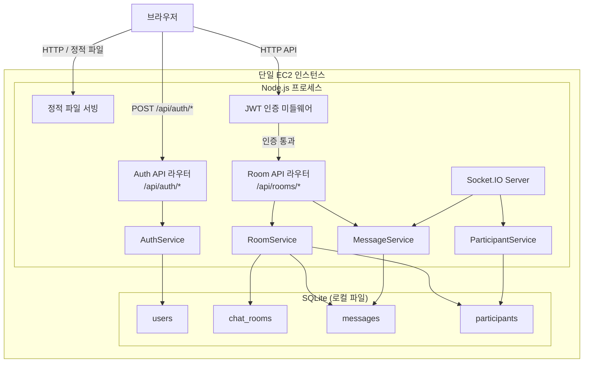
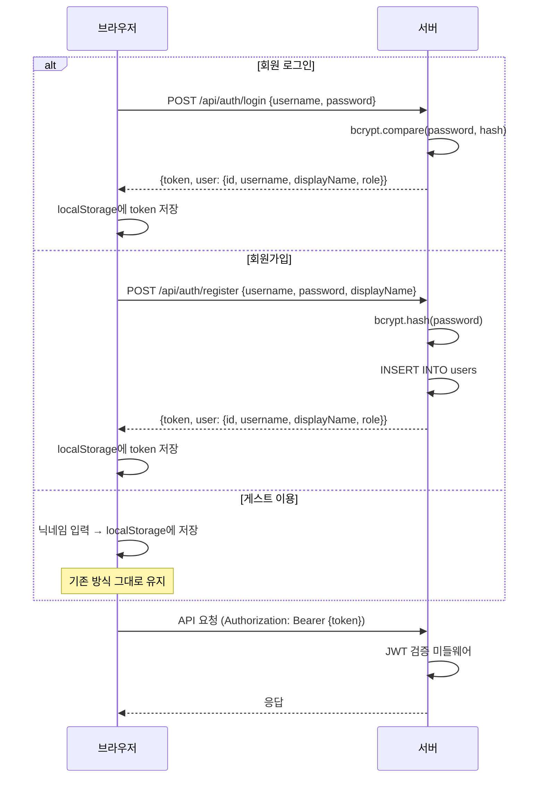

# 설계 문서: 선택적 인증 (Optional Auth)

## 개요

기존 채팅방 애플리케이션에 선택적 회원가입/로그인 시스템을 추가한다. 사용자는 사이트 접속 시 로그인 페이지에서 회원 로그인, 회원가입, 또는 게스트 이용 중 하나를 선택할 수 있다. 기존의 닉네임 기반 게스트 이용 방식은 그대로 유지하면서, 회원 사용자에게는 JWT 기반 인증과 일관된 사용자 정보를 제공한다. 운영자(admin) 계정은 대화방 삭제 권한을 가지며, 서버 시작 시 기본 운영자 계정이 자동 생성된다.

핵심 변경 사항:
- 로그인 페이지 추가 (기존 `UserNamePrompt` 대체)
- 회원가입/로그인 REST API 추가
- JWT 토큰 발급 및 검증 미들웨어
- `users` 테이블 추가 (bcrypt 해싱된 비밀번호 저장)
- 운영자 전용 대화방 삭제 API 및 UI
- 서버 시작 시 기본 admin 계정 자동 생성

## 아키텍처

기존 단일 EC2 인스턴스 아키텍처를 유지하면서, 인증/인가 계층을 추가한다. 새로운 `AuthService`가 회원가입, 로그인, 토큰 검증을 담당하고, Express 미들웨어로 JWT 검증을 수행한다.



### 인증 흐름



### 권한 모델

| 역할 | 대화방 생성 | 목록 조회 | 참여/메시지 | 대화방 삭제 | 다른 브라우저에서 이력 유지 |
|------|:---------:|:--------:|:----------:|:----------:|:------------------------:|
| Guest | ✅ | ✅ | ✅ | ❌ | ❌ |
| User (회원) | ✅ | ✅ | ✅ | ❌ | ✅ |
| Admin (운영자) | ✅ | ✅ | ✅ | ✅ | ✅ |

## 컴포넌트 및 인터페이스

### 새로운 REST API 엔드포인트

| 메서드 | 경로 | 인증 | 설명 |
|--------|------|:----:|------|
| POST | `/api/auth/register` | 불필요 | 회원가입 |
| POST | `/api/auth/login` | 불필요 | 로그인 |
| DELETE | `/api/rooms/:roomId` | Admin 필수 | 대화방 삭제 |

### 기존 API 변경 사항

기존 REST API와 Socket.IO 이벤트는 변경 없이 유지한다. 게스트 사용자도 기존과 동일하게 모든 채팅 기능을 사용할 수 있다. 대화방 삭제 API만 admin 역할 검증이 필요하다.

### Socket.IO 이벤트 추가

| 이벤트 | 방향 | 페이로드 | 설명 |
|--------|------|----------|------|
| `room:deleted` | Server → Client | `{ roomId: string }` | 대화방 삭제 알림 |

### 서비스 계층 인터페이스

```typescript
// AuthService (신규)
interface AuthService {
  register(username: string, password: string, displayName: string): Promise<{ token: string; user: AuthUser }>;
  login(username: string, password: string): Promise<{ token: string; user: AuthUser }>;
  verifyToken(token: string): AuthPayload;
  ensureAdminExists(): void;
}

// RoomService (삭제 메서드 추가)
interface RoomService {
  // ... 기존 메서드 유지
  deleteRoom(roomId: string): Promise<void>;
}

// GuestCleanupService (신규)
interface GuestCleanupService {
  /** 서버 시작 시 호출. joined_at이 30일 이상 경과한 게스트 참여자 레코드를 삭제한다. */
  cleanupInactiveGuests(): void;
}
```

### JWT 미들웨어

```typescript
// optionalAuth: 토큰이 있으면 검증, 없으면 통과 (게스트 허용)
function optionalAuth(req: Request, res: Response, next: NextFunction): void;

// requireAdmin: admin 역할 필수
function requireAdmin(req: Request, res: Response, next: NextFunction): void;
```

### 프론트엔드 컴포넌트 변경

```
App
├── LoginPage (신규)          // 로그인 화면
│   ├── LoginForm (신규)      // 아이디/비밀번호 입력 + 로그인 버튼
│   └── "게스트로 이용하기" 버튼
├── RegisterPage (신규)       // 회원가입 화면
├── GuestNicknamePage (수정)  // 게스트 닉네임 입력 화면
│   └── GuestWarningNotice (신규)  // 게스트 경고 문구 표시
├── RoomListPage (수정)       // Admin일 때 삭제 버튼 표시
│   ├── RoomCreateForm
│   └── RoomList
│       └── RoomCard (수정)   // Admin일 때 삭제 버튼 포함
└── ChatRoomPage
    ├── MessageList
    ├── MessageInput
    └── ParticipantList
```

### 인증 상태 관리 (프론트엔드)

```typescript
// useAuth 훅 (신규) - 기존 useUserInfo를 확장
interface AuthState {
  isAuthenticated: boolean;  // 회원 로그인 여부
  isGuest: boolean;          // 게스트 여부
  userId: string;
  userName: string;
  role: 'admin' | 'user' | 'guest';
  token: string | null;
  login(username: string, password: string): Promise<void>;
  register(username: string, password: string, displayName: string): Promise<void>;
  loginAsGuest(nickname: string): void;
  logout(): void;
}
```

## 데이터 모델

### users 테이블 (신규)

| 컬럼 | 타입 | 설명 |
|------|------|------|
| id | TEXT PRIMARY KEY | 고유 식별자 (UUID) |
| username | TEXT NOT NULL UNIQUE | 로그인 아이디 |
| password_hash | TEXT NOT NULL | bcrypt 해싱된 비밀번호 |
| display_name | TEXT NOT NULL | 표시 이름 (채팅방에서 사용) |
| role | TEXT NOT NULL DEFAULT 'user' | 역할 ('user' \| 'admin') |
| created_at | TEXT NOT NULL DEFAULT (datetime('now')) | 생성 시각 |

### 기존 테이블 변경 사항

기존 `chat_rooms`, `messages`, `participants` 테이블은 변경하지 않는다. 대화방 삭제 시 외래키 제약에 의해 관련 `messages`와 `participants` 레코드를 먼저 삭제한 후 `chat_rooms` 레코드를 삭제한다.

### TypeScript 타입 정의 (신규)

```typescript
/** 사용자 계정 엔티티 */
interface UserAccount {
  id: string;
  username: string;
  passwordHash: string;
  displayName: string;
  role: 'user' | 'admin';
  createdAt: Date;
}

/** JWT 페이로드 */
interface AuthPayload {
  userId: string;
  username: string;
  displayName: string;
  role: 'user' | 'admin';
}

/** 클라이언트에 반환되는 사용자 정보 (비밀번호 제외) */
interface AuthUser {
  id: string;
  username: string;
  displayName: string;
  role: 'user' | 'admin';
}

/** 로그인/회원가입 응답 */
interface AuthResponse {
  token: string;
  user: AuthUser;
}
```

### JWT 토큰 구조

```json
{
  "userId": "uuid",
  "username": "admin",
  "displayName": "관리자",
  "role": "admin",
  "iat": 1700000000,
  "exp": 1700086400
}
```

토큰 만료 시간: 24시간. 서명 키는 환경 변수 `JWT_SECRET`에서 읽으며, 미설정 시 기본값 `"chat-rooms-secret"` 사용.

## 게스트 참여자 정리 (Guest Cleanup)

서버 시작 시 `GuestCleanupService.cleanupInactiveGuests()`를 호출하여 비활성 게스트 참여자 레코드를 정리한다.

### 정리 로직

```sql
DELETE FROM participants
WHERE user_id NOT IN (SELECT id FROM users)
  AND joined_at < datetime('now', '-30 days');
```

- `users` 테이블에 존재하지 않는 `user_id`를 가진 참여자를 게스트로 판별한다
- `joined_at`이 현재 시각 기준 30일 이상 경과한 게스트 참여자 레코드를 삭제한다
- 서버 시작 시 1회만 실행하며, 주기적 실행은 하지 않는다
- `ensureAdminExists()` 호출 이후에 실행하여 admin 계정이 먼저 생성되도록 한다


## 정확성 속성 (Correctness Properties)

*속성(Property)이란 시스템의 모든 유효한 실행에서 참이어야 하는 특성 또는 동작을 의미한다. 속성은 사람이 읽을 수 있는 명세와 기계가 검증할 수 있는 정확성 보장 사이의 다리 역할을 한다.*

### Property 1: 회원가입-로그인 라운드트립

*For any* 유효한 아이디(username), 비밀번호(password), 표시 이름(displayName) 조합으로 회원가입을 수행한 후 동일한 아이디와 비밀번호로 로그인하면, 반환된 JWT 토큰을 디코딩했을 때 userId, username, displayName, role 필드가 모두 존재하고 회원가입 시 입력한 값과 일치해야 한다.

**Validates: Requirements 1.2, 3.3, 5.1, 5.2**

### Property 2: 비밀번호 해싱 저장

*For any* 유효한 회원가입 요청에 대해, 데이터베이스에 저장된 password_hash는 원본 비밀번호와 다르며(평문 저장 금지), bcrypt.compare(원본 비밀번호, 저장된 해시)가 true를 반환해야 한다.

**Validates: Requirements 3.2**

### Property 3: 잘못된 자격 증명 거부

*For any* 등록된 사용자에 대해, 등록된 비밀번호와 다른 임의의 문자열로 로그인을 시도하면 시스템은 인증을 거부해야 한다.

**Validates: Requirements 1.3**

### Property 4: 중복 아이디 거부

*For any* 아이디에 대해, 동일한 아이디로 두 번 회원가입을 시도하면 두 번째 시도는 거부되어야 하며, 첫 번째 계정은 영향을 받지 않아야 한다.

**Validates: Requirements 3.4**

### Property 5: 비밀번호 확인 불일치 거부

*For any* 서로 다른 두 문자열을 비밀번호와 비밀번호 확인으로 사용하여 회원가입을 시도하면, 시스템은 가입을 거부해야 한다.

**Validates: Requirements 3.5**

### Property 6: 대화방 삭제 캐스케이드

*For any* 대화방과 해당 대화방에 속한 임의 개수의 메시지 및 참여자에 대해, 대화방을 삭제하면 해당 대화방의 모든 메시지와 참여자 레코드가 데이터베이스에서 제거되어야 한다.

**Validates: Requirements 4.3**

### Property 7: 비관리자 삭제 금지

*For any* admin이 아닌 사용자(guest 또는 일반 user)가 대화방 삭제 API를 호출하면, 시스템은 403 응답을 반환하고 대화방은 삭제되지 않아야 한다.

**Validates: Requirements 4.5**

### Property 8: 유효하지 않은 토큰 거부

*For any* 유효하지 않은 JWT 문자열(변조, 만료, 잘못된 형식)로 인증이 필요한 API를 호출하면, 시스템은 401 Unauthorized 응답을 반환해야 한다.

**Validates: Requirements 5.4**

### Property 9: 운영자 계정 생성 멱등성

*For any* 횟수만큼 ensureAdminExists를 반복 호출해도, users 테이블에는 username이 "admin"인 계정이 정확히 하나만 존재하고 role이 "admin"이어야 한다.

**Validates: Requirements 6.1, 6.3, 6.4**

### Property 10: 비활성 게스트 참여자 정리

*For any* 게스트 참여자 레코드 집합에 대해, cleanupInactiveGuests를 실행하면 joined_at이 30일 이상 경과한 게스트 참여자 레코드만 삭제되고, 30일 미만인 게스트 참여자와 Registered_User의 참여자 레코드는 영향을 받지 않아야 한다.

**Validates: Requirements 8.1, 8.2**

## 오류 처리

| 상황 | 처리 방식 |
|------|-----------|
| 로그인 시 잘못된 자격 증명 | 401 Unauthorized + "아이디 또는 비밀번호가 올바르지 않습니다" |
| 로그인 시 빈 아이디/비밀번호 | 400 Bad Request + 필수 입력 항목 안내 |
| 회원가입 시 중복 아이디 | 409 Conflict + "이미 사용 중인 아이디입니다" |
| 회원가입 시 비밀번호 불일치 | 400 Bad Request + "비밀번호가 일치하지 않습니다" |
| 회원가입 시 빈 필수 항목 | 400 Bad Request + 해당 필수 입력 항목 안내 |
| 유효하지 않은/만료된 JWT | 401 Unauthorized |
| 비관리자의 대화방 삭제 시도 | 403 Forbidden |
| 존재하지 않는 대화방 삭제 시도 | 404 Not Found |
| bcrypt 해싱 실패 | 500 Internal Server Error + 서버 로그 기록 |

## 테스트 전략

### 단위 테스트 (Unit Tests)

- 테스트 프레임워크: Jest
- 대상: AuthService의 비즈니스 로직, JWT 미들웨어, RoomService.deleteRoom
- 주요 테스트 케이스:
  - 로그인 페이지 렌더링 시 필수 UI 요소 존재 확인 (요구사항 1.1)
  - 유효한 토큰 보유 시 로그인 페이지 건너뛰기 (요구사항 1.5)
  - 게스트 버튼 클릭 시 닉네임 입력 화면 표시 (요구사항 2.1)
  - 회원가입 링크 클릭 시 회원가입 양식 표시 (요구사항 3.1)
  - Admin 사용자에게만 삭제 버튼 표시 (요구사항 4.1, 4.4)
  - 삭제 확인 대화 상자 표시 (요구사항 4.2)
  - 로그아웃 시 토큰 삭제 및 리다이렉트 (요구사항 5.3)
  - 환경 변수 유무에 따른 admin 비밀번호 설정 (요구사항 6.2)

### 속성 기반 테스트 (Property-Based Tests)

- 테스트 라이브러리: fast-check
- 각 속성 테스트는 최소 100회 반복 실행
- 각 테스트에 설계 문서의 속성 번호를 태그로 표기
- 태그 형식: **Feature: optional-auth, Property {번호}: {속성 설명}**
- 대상 속성:
  - Property 1: 회원가입-로그인 라운드트립
  - Property 2: 비밀번호 해싱 저장
  - Property 3: 잘못된 자격 증명 거부
  - Property 4: 중복 아이디 거부
  - Property 5: 비밀번호 확인 불일치 거부
  - Property 6: 대화방 삭제 캐스케이드
  - Property 7: 비관리자 삭제 금지
  - Property 8: 유효하지 않은 토큰 거부
  - Property 9: 운영자 계정 생성 멱등성
  - Property 10: 비활성 게스트 참여자 정리

### 통합 테스트 (Integration Tests)

- 테스트 프레임워크: Jest + supertest
- 대상: REST API 엔드포인트 간 연동
- 주요 테스트 케이스:
  - 게스트 사용자의 기존 채팅 기능 정상 동작 (요구사항 2.4)
  - 대화방 삭제 시 Socket.IO를 통한 참여자 알림 전달 (요구사항 4.6)
  - 회원 사용자의 표시 이름이 채팅방에서 사용되는지 확인 (요구사항 5.5)
