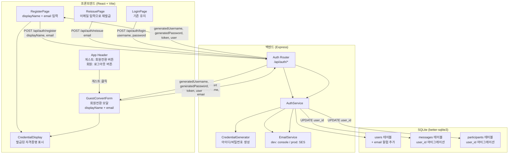
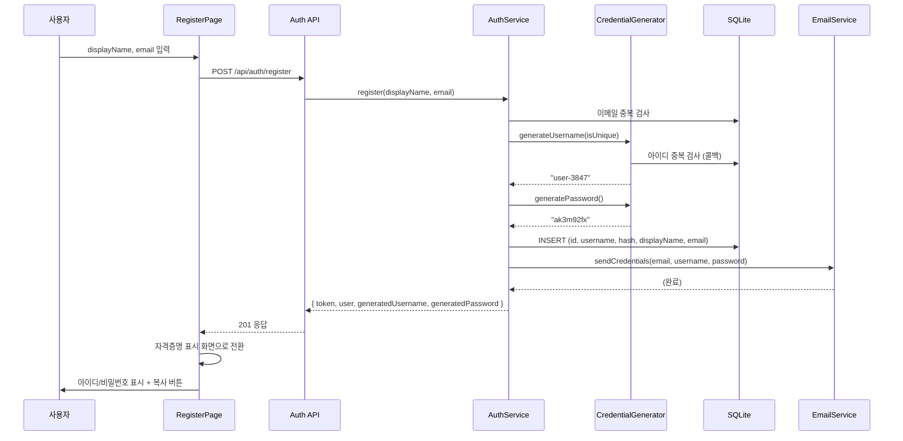
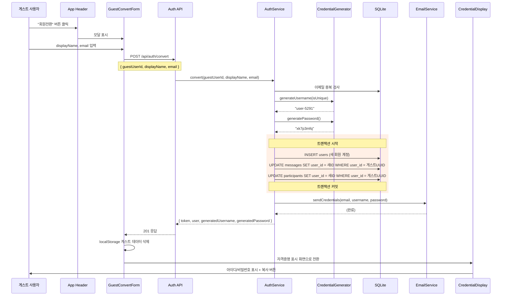

# 설계 문서: 서버 발급 자격증명

## 개요

현재 채팅 애플리케이션의 회원가입 흐름을 변경하여, 사용자가 직접 아이디/비밀번호를 선택하는 대신 서버가 랜덤으로 생성하여 발급하는 방식으로 전환한다. 이를 통해 사용자가 다른 사이트의 자격증명을 재사용하는 보안 위험을 방지한다.

주요 변경 사항:
- 회원가입 시 사용자는 `displayName`과 `email`만 입력
- 서버가 `user-XXXX` 형식의 아이디와 8자리 영소문자+숫자 비밀번호를 생성
- 발급된 자격증명은 화면에 표시 + 이메일로 발송
- 자격증명 분실 시 이메일을 통한 재발급 기능 추가
- 이메일 서비스는 dev 모드(콘솔 로그)와 prod 모드(AWS SES) 지원
- 기존 사용자 계정은 변경 없이 유지
- 로그인 흐름은 기존과 동일
- 게스트 사용자가 회원으로 전환 가능 (기존 메시지/참여 기록 이전)

## 아키텍처

### 시스템 구성도



### 변경 범위

기존 코드에서 수정이 필요한 영역:

| 영역 | 파일 | 변경 내용 |
|------|------|-----------|
| DB 스키마 | `server/src/db/migrate.ts` | `users` 테이블에 `email` 컬럼 추가 |
| 타입 정의 | `shared/types/models.ts` | `UserAccount`, `AuthResponse` 타입 확장, `ConvertResponse` 추가 |
| 타입 정의 | `shared/types/services.ts` | `AuthService` 인터페이스 변경, `EmailService` 추가, `convert` 메서드 추가 |
| 서버 서비스 | `server/src/services/auth.service.ts` | `register` 시그니처 변경, `reissue` 메서드 추가, `convert` 메서드 추가 |
| 서버 서비스 | `server/src/services/credential-generator.ts` | 새 파일 - 아이디/비밀번호 생성 |
| 서버 서비스 | `server/src/services/email.service.ts` | 새 파일 - 이메일 발송 (dev/prod) |
| 서버 라우트 | `server/src/routes/auth.ts` | register 엔드포인트 변경, reissue 엔드포인트 추가, convert 엔드포인트 추가 |
| 서버 진입점 | `server/src/index.ts` | EmailService 초기화 및 주입 |
| 클라이언트 페이지 | `client/src/pages/RegisterPage.tsx` | 폼 필드 변경 + 자격증명 표시 화면 |
| 클라이언트 페이지 | `client/src/pages/ReissuePage.tsx` | 새 파일 - 자격증명 재발급 페이지 |
| 클라이언트 컴포넌트 | `client/src/components/GuestConvertForm.tsx` | 새 파일 - 게스트 회원전환 모달 (displayName + email 입력) |
| 클라이언트 컴포넌트 | `client/src/components/CredentialDisplay.tsx` | 새 파일 - 자격증명 표시 공통 컴포넌트 (회원가입/회원전환 공용) |
| 클라이언트 훅 | `client/src/hooks/useAuth.ts` | `register` 함수 시그니처 변경, `convertGuest` 함수 추가 |
| 클라이언트 앱 | `client/src/App.tsx` | 라우팅 추가 (재발급 페이지), 헤더에 회원전환 버튼 추가, 회원전환 모달 상태 관리 |
| 클라이언트 로그인 | `client/src/pages/LoginPage.tsx` | "자격증명을 잊으셨나요?" 링크 추가 |

## 컴포넌트 및 인터페이스

### 1. CredentialGenerator (새 모듈)

`server/src/services/credential-generator.ts`

순수 함수 모듈로, 랜덤 아이디와 비밀번호를 생성한다.

```typescript
/**
 * "user-" 접두사 + 4자리 랜덤 숫자로 아이디 생성
 * DB에서 중복 검사를 위한 콜백을 받아 고유성 보장
 */
function generateUsername(isUnique: (username: string) => boolean): string;

/**
 * 8자의 영문 소문자 + 숫자 조합 비밀번호 생성
 */
function generatePassword(): string;
```

아이디 생성 시 `isUnique` 콜백을 통해 DB 중복 검사를 수행한다. 최대 재시도 횟수(10회)를 두어 무한 루프를 방지한다.

### 2. EmailService (새 모듈)

`server/src/services/email.service.ts`

인터페이스 기반으로 dev/prod 모드를 분리한다.

```typescript
interface EmailService {
  sendCredentials(to: string, username: string, password: string): Promise<void>;
  sendReissuedCredentials(to: string, username: string, newPassword: string): Promise<void>;
}

class ConsoleEmailService implements EmailService { /* dev 모드: 콘솔 출력 */ }
class SesEmailService implements EmailService { /* prod 모드: AWS SES */ }

function createEmailService(): EmailService;
```

`createEmailService()`는 환경변수 `EMAIL_MODE`를 확인하여:
- `EMAIL_MODE=ses` → `SesEmailService` 반환
- 그 외 (기본값) → `ConsoleEmailService` 반환

### 3. AuthService 변경

`server/src/services/auth.service.ts`

```typescript
// 기존
register(username: string, password: string, displayName: string): Promise<{ token: string; user: AuthUser }>;

// 변경 후
register(displayName: string, email: string): Promise<{
  token: string;
  user: AuthUser;
  generatedUsername: string;
  generatedPassword: string;
}>;

// 새 메서드 - 자격증명 재발급
reissue(email: string): Promise<void>;

// 새 메서드 - 게스트 → 회원 전환
convert(guestUserId: string, displayName: string, email: string): Promise<{
  token: string;
  user: AuthUser;
  generatedUsername: string;
  generatedPassword: string;
}>;
```

`AuthService` 생성자에 `EmailService`를 주입받는다.

`convert` 메서드의 처리 흐름:
1. 이메일 중복 검사
2. `CredentialGenerator`로 아이디/비밀번호 생성
3. `users` 테이블에 새 회원 계정 INSERT
4. `messages` 테이블에서 `user_id = guestUserId`인 레코드를 새 회원 ID로 UPDATE
5. `participants` 테이블에서 `user_id = guestUserId`인 레코드를 새 회원 ID로 UPDATE
6. `EmailService`로 자격증명 이메일 발송
7. JWT 토큰 생성 및 응답 반환

4~5단계는 트랜잭션으로 묶어 원자성을 보장한다.

### 4. Auth Router 변경

`server/src/routes/auth.ts`

```
POST /api/auth/register
  요청: { displayName: string, email: string }
  응답 201: { token, user, generatedUsername, generatedPassword }
  오류 400: 표시 이름 또는 이메일 누락
  오류 409: 이메일 중복

POST /api/auth/reissue
  요청: { email: string }
  응답 200: { message: "입력하신 이메일로 새 자격증명을 발송했습니다" }
  오류 404: 일치하는 계정 없음

POST /api/auth/convert
  요청: { guestUserId: string, displayName: string, email: string }
  응답 201: { token, user, generatedUsername, generatedPassword }
  오류 400: guestUserId, 표시 이름, 또는 이메일 누락
  오류 409: 이메일 중복

POST /api/auth/login (변경 없음)
```

### 5. RegisterPage 변경

`client/src/pages/RegisterPage.tsx`

두 단계 UI:
1. **입력 단계**: displayName + email 입력 폼
2. **자격증명 표시 단계**: 발급된 username/password 표시 + 복사 버튼 + 경고 메시지 + "확인했습니다" 버튼

상태 관리를 위해 `useState`로 `step: 'form' | 'credentials'`를 관리한다.

### 6. ReissuePage (새 페이지)

`client/src/pages/ReissuePage.tsx`

이메일 입력 → 재발급 요청 → 성공 메시지 표시의 단순한 흐름.

### 7. useAuth 훅 변경

`client/src/hooks/useAuth.ts`

```typescript
// 기존
register: (username: string, password: string, displayName: string) => Promise<void>;

// 변경 후
register: (displayName: string, email: string) => Promise<{
  generatedUsername: string;
  generatedPassword: string;
}>;

// 새 함수 - 게스트 회원전환
convertGuest: (displayName: string, email: string) => Promise<{
  generatedUsername: string;
  generatedPassword: string;
}>;
```

register 성공 시 자격증명 정보를 반환하여 RegisterPage에서 표시할 수 있도록 한다.

`convertGuest` 함수는:
1. 현재 게스트 userId를 localStorage에서 가져옴
2. `POST /api/auth/convert`에 `{ guestUserId, displayName, email }` 전송
3. 응답의 JWT 토큰을 localStorage에 저장
4. 게스트 관련 localStorage 키(`chat_userId`, `chat_userName`) 삭제
5. 인증 상태를 회원으로 전환
6. `{ generatedUsername, generatedPassword }` 반환

### 8. GuestConvertForm (새 컴포넌트)

`client/src/components/GuestConvertForm.tsx`

게스트 사용자가 회원으로 전환할 때 표시되는 모달/폼 컴포넌트.

```typescript
interface GuestConvertFormProps {
  currentDisplayName: string;  // 기존 게스트 닉네임을 기본값으로
  onConvert: (displayName: string, email: string) => Promise<{
    generatedUsername: string;
    generatedPassword: string;
  }>;
  onClose: () => void;
}
```

- displayName 입력 필드 (기존 게스트 닉네임이 기본값)
- email 입력 필드
- "회원전환" 제출 버튼, "취소" 버튼
- 전환 성공 시 `CredentialDisplay` 컴포넌트로 전환

### 9. CredentialDisplay (새 공통 컴포넌트)

`client/src/components/CredentialDisplay.tsx`

회원가입과 회원전환 모두에서 사용하는 자격증명 표시 컴포넌트.

```typescript
interface CredentialDisplayProps {
  username: string;
  password: string;
  onConfirm: () => void;
}
```

- 발급된 아이디/비밀번호 표시
- 각각의 복사 버튼
- "이 정보는 다시 표시되지 않습니다" 경고 메시지
- "확인했습니다" 버튼

### 10. App.tsx 헤더 변경

`client/src/App.tsx`

게스트 상태일 때 헤더 버튼 변경:

```typescript
// 기존: 게스트일 때 "로그인" 버튼 → auth.logout() 호출
// 변경: 게스트일 때 "회원전환" 버튼 → 회원전환 모달 표시

// App 컴포넌트에 추가되는 상태
const [showConvertForm, setShowConvertForm] = useState(false);
const [convertCredentials, setConvertCredentials] = useState<{
  generatedUsername: string;
  generatedPassword: string;
} | null>(null);
```

헤더 영역:
- 게스트: "회원전환" 버튼 (클릭 시 `GuestConvertForm` 모달 표시)
- 회원: "로그아웃" 버튼 (기존 유지)

## 데이터 모델

### users 테이블 스키마 변경

```sql
-- 기존 스키마에 email 컬럼 추가 (마이그레이션)
ALTER TABLE users ADD COLUMN email TEXT;

-- 새로 가입하는 사용자는 email 필수
-- 기존 사용자는 email이 NULL일 수 있음
-- email에 UNIQUE 인덱스 추가 (NULL은 중복 허용)
CREATE UNIQUE INDEX IF NOT EXISTS idx_users_email ON users(email) WHERE email IS NOT NULL;
```

### 타입 변경

```typescript
// shared/types/models.ts

// UserAccount에 email 추가
interface UserAccount {
  id: string;
  username: string;
  passwordHash: string;
  displayName: string;
  email: string | null;  // 기존 사용자는 null
  role: 'user' | 'admin';
  createdAt: Date;
}

// 회원가입 응답 확장
interface RegisterResponse {
  token: string;
  user: AuthUser;
  generatedUsername: string;
  generatedPassword: string;
}

// 게스트 회원전환 응답 (RegisterResponse와 동일 구조)
interface ConvertResponse {
  token: string;
  user: AuthUser;
  generatedUsername: string;
  generatedPassword: string;
}
```

### 데이터 흐름



### 게스트 회원전환 데이터 흐름




## 정확성 속성 (Correctness Properties)

*속성(property)이란 시스템의 모든 유효한 실행에서 참이어야 하는 특성 또는 동작을 의미한다. 속성은 사람이 읽을 수 있는 명세와 기계가 검증할 수 있는 정확성 보장 사이의 다리 역할을 한다.*

### Property 1: 아이디 형식 준수

*For any* 호출에서, `generateUsername`이 반환하는 아이디는 반드시 `user-` 접두사와 정확히 4자리 숫자로 구성되어야 한다 (정규식: `/^user-\d{4}$/`).

**Validates: Requirements 1.1**

### Property 2: 아이디 고유성 보장

*For any* 기존 아이디 집합에 대해, `generateUsername`이 반환하는 아이디는 해당 집합에 포함되지 않아야 한다.

**Validates: Requirements 1.2**

### Property 3: 비밀번호 형식 준수

*For any* 호출에서, `generatePassword`가 반환하는 비밀번호는 반드시 정확히 8자이며 영문 소문자와 숫자로만 구성되어야 한다 (정규식: `/^[a-z0-9]{8}$/`).

**Validates: Requirements 2.1**

### Property 4: 비밀번호 저장 정확성

*For any* 유효한 displayName과 email로 회원가입을 수행한 후, 데이터베이스에 저장된 password_hash는 생성된 평문 비밀번호와 bcrypt.compare로 일치해야 하며, 데이터베이스의 어떤 컬럼에도 평문 비밀번호가 저장되어 있지 않아야 한다.

**Validates: Requirements 2.2, 2.3**

### Property 5: 회원가입 응답 완전성

*For any* 유효한 displayName과 email로 회원가입 요청을 보내면, 응답에는 반드시 `generatedUsername` (user-XXXX 형식), `generatedPassword` (8자 영소문자+숫자), `token` (유효한 JWT), `user` (id, username, displayName, role 포함) 필드가 모두 존재해야 한다.

**Validates: Requirements 3.1, 3.5, 3.6**

### Property 6: 회원가입 입력 검증

*For any* 공백 문자열(빈 문자열, 스페이스, 탭 등)을 displayName 또는 email로 전송하면, 서버는 HTTP 400 상태 코드를 반환해야 한다.

**Validates: Requirements 3.2, 3.3**

### Property 7: 이메일 고유성 강제

*For any* 이미 등록된 이메일로 다시 회원가입을 시도하면, 서버는 HTTP 409 상태 코드를 반환해야 한다.

**Validates: Requirements 3.4**

### Property 8: 자격증명 재발급 라운드트립

*For any* 유효한 displayName과 email로 회원가입한 후, 해당 email로 재발급을 요청하면 성공해야 하며, 재발급 후 새로운 비밀번호로 로그인이 가능해야 한다 (이전 비밀번호로는 로그인 불가).

**Validates: Requirements 7.1, 7.2**

### Property 9: 미등록 이메일 재발급 거부

*For any* 등록되지 않은 이메일로 재발급을 요청하면, 서버는 HTTP 404 상태 코드를 반환해야 한다.

**Validates: Requirements 7.3**

### Property 10: 게스트 회원전환 응답 완전성 및 계정 생성

*For any* 유효한 게스트 UUID, displayName, email로 회원전환을 요청하면, 응답에는 반드시 `generatedUsername` (user-XXXX 형식), `generatedPassword` (8자 영소문자+숫자), `token` (유효한 JWT), `user` (id, username, displayName, role 포함) 필드가 모두 존재해야 하며, 데이터베이스에 해당 회원 계정이 생성되어 있어야 한다.

**Validates: Requirements 9.1, 9.2**

### Property 11: 게스트 데이터 마이그레이션 완전성

*For any* 게스트 UUID로 생성된 메시지와 참여 기록에 대해, 회원전환이 성공하면 해당 게스트 UUID로 된 모든 messages.user_id와 participants.user_id가 새 회원 ID로 업데이트되어야 하며, 기존 게스트 UUID로 된 레코드는 남아있지 않아야 한다.

**Validates: Requirements 9.3, 9.4**

## 오류 처리

### 서버 측

| 상황 | HTTP 상태 | 오류 메시지 | 처리 방식 |
|------|-----------|-------------|-----------|
| displayName 누락/빈값 | 400 | "표시 이름을 입력해주세요" | 라우터에서 검증 |
| email 누락/빈값 | 400 | "이메일을 입력해주세요" | 라우터에서 검증 |
| 이메일 중복 | 409 | "이미 사용 중인 이메일입니다" | AuthService에서 DB 조회 후 throw |
| 아이디 생성 실패 (10회 초과) | 500 | "아이디 생성에 실패했습니다" | CredentialGenerator에서 throw |
| 재발급 시 이메일 미존재 | 404 | "일치하는 계정을 찾을 수 없습니다" | AuthService에서 throw |
| 이메일 발송 실패 | 500 | "이메일 발송에 실패했습니다" | EmailService에서 throw, 회원가입은 롤백하지 않음 (자격증명은 화면에 표시됨) |
| JWT 토큰 무효 | 401 | "유효하지 않은 토큰입니다" | 기존 미들웨어 유지 |
| 회원전환 시 guestUserId 누락 | 400 | "게스트 사용자 ID를 입력해주세요" | 라우터에서 검증 |
| 회원전환 시 displayName 누락 | 400 | "표시 이름을 입력해주세요" | 라우터에서 검증 |
| 회원전환 시 email 누락 | 400 | "이메일을 입력해주세요" | 라우터에서 검증 |
| 회원전환 시 이메일 중복 | 409 | "이미 사용 중인 이메일입니다" | AuthService에서 DB 조회 후 throw |
| 회원전환 시 데이터 마이그레이션 실패 | 500 | "회원전환 처리 중 오류가 발생했습니다" | 트랜잭션 롤백 |

### 클라이언트 측

- 회원가입 폼: 서버 오류 메시지를 그대로 표시
- 자격증명 표시 화면: 페이지 새로고침/이탈 시 경고 (자격증명 분실 방지)
- 재발급 페이지: 서버 오류 메시지를 그대로 표시, 성공 시 안내 메시지 표시
- 회원전환 폼: 서버 오류 메시지를 그대로 표시, 성공 시 자격증명 표시 화면으로 전환
- 회원전환 성공 후: 게스트 localStorage 데이터 삭제, 인증 상태를 회원으로 전환

### 이메일 발송 실패 정책

이메일 발송이 실패해도 회원가입 자체는 성공으로 처리한다. 이유:
1. 자격증명은 화면에도 표시되므로 사용자가 확인 가능
2. 이메일 발송 실패로 인한 회원가입 롤백은 사용자 경험을 저해
3. 이메일 발송 실패 시 서버 로그에 경고를 남김

## 테스트 전략

### Property-Based Testing (fast-check)

프로젝트에 이미 `fast-check` 라이브러리가 설치되어 있으므로 이를 활용한다.

각 property 테스트는 최소 100회 반복 실행하며, 설계 문서의 property를 참조하는 태그를 포함한다.

대상 모듈:
- `CredentialGenerator`: Property 1, 2, 3 (순수 함수, PBT에 최적)
- `AuthService`: Property 4, 5, 6, 7, 8, 9, 10, 11 (in-memory SQLite + mock EmailService로 테스트)

태그 형식: `Feature: server-issued-credentials, Property {number}: {title}`

### Unit Testing (Jest)

example 기반 단위 테스트 대상:
- UI 컴포넌트 렌더링 (4.1, 4.2, 5.1~5.4)
- 기존 기능 유지 확인 (6.1~6.3, 8.1~8.2)
- 이메일 서비스 mock 호출 검증 (3.7, 9.5)
- 게스트 회원전환 UI (9.6, 9.7, 9.8): 헤더 버튼 표시, 모달 표시, 자격증명 표시 및 localStorage 삭제

### Integration Testing

- 회원가입 → 로그인 전체 흐름 (supertest)
- 회원가입 → 재발급 → 새 비밀번호 로그인 전체 흐름
- 기존 사용자 로그인 호환성
- 게스트 회원전환 → 로그인 전체 흐름
- 게스트 회원전환 후 메시지/참여 기록 마이그레이션 검증

### 테스트 파일 구조

```
server/src/services/__tests__/
  credential-generator.test.ts   # Property 1, 2, 3
  auth.service.test.ts            # Property 4, 5, 6, 7, 8, 9, 10, 11
  email.service.test.ts           # 이메일 서비스 단위 테스트
server/src/routes/__tests__/
  auth.test.ts                    # API 통합 테스트 (register, login, reissue, convert)
client/src/components/__tests__/
  GuestConvertForm.test.tsx       # 회원전환 모달 단위 테스트
  CredentialDisplay.test.tsx      # 자격증명 표시 컴포넌트 단위 테스트
```
